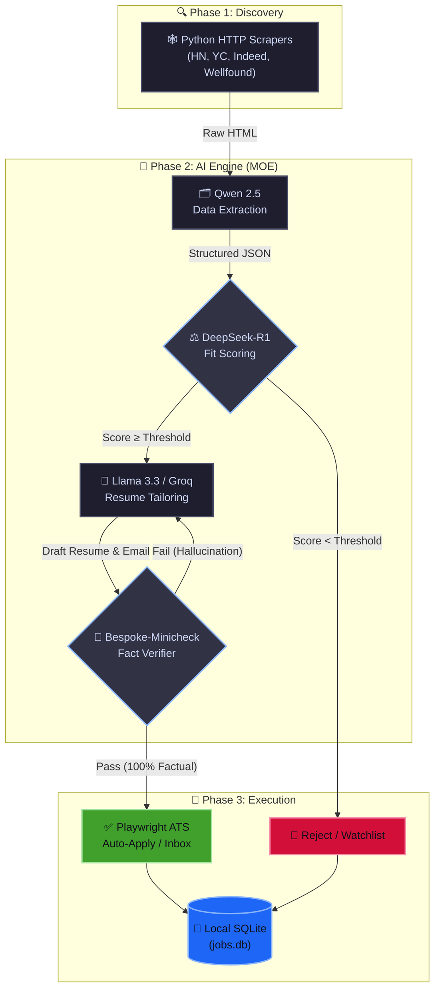

<p align="center">
  
</p>

<h1 align="center">
  SPrav Job AI
</h1>

<h4 align="center">The autonomous, offline-first AI agent for hyper-personalized job hunting and auto-applying.</h4>

<p align="center">
  <a href="#-what-it-does">What</a> •
  <a href="#-how-it-works">How</a> •
  <a href="#-security--offline-auth">Security</a> •
  <a href="#-architecture">Architecture</a> •
  <a href="#-repository-structure">Structure</a> •
  <a href="#-configuration-env">Config</a> •
  <a href="#-installation">Install</a>
</p>

<p align="center">
  <a href="https://github.com/SVSPraveen/SPrav-Job-AI/stargazers"></a>
  <a href="https://github.com/SVSPraveen/SPrav-Job-AI/network/members"></a>
  <a href="https://github.com/SVSPraveen/SPrav-Job-AI/issues"></a>
  
  
  
  
</p>

<br/>

> *Companies use AI to filter candidates. SPrav gives candidates AI to filter and apply to companies.*

---

## 🎯 What it does

Job hunting is a full-time job. **SPrav completely automates the most exhausting parts of the process.** 

Instead of mindlessly scrolling through job boards, SPrav acts as your personal, highly-coordinated AI workforce:
- 🌐 **Monitors the internet** for new job postings (Indeed, Hacker News, Y Combinator, Wellfound) using native, credential-free HTTP scrapers.
- 🎯 **Explicitly targets** your preferred markets (e.g., India, Remote) and mathematically calculates if you are a good fit based on your background.
- ✍️ **Custom-rewrites** your resume for that specific job to effortlessly bypass ATS keyword filters.
- 📨 **Drops a completely finished application** package and cold-email draft directly into your Human Review queue.

*(Note: LinkedIn automation has been explicitly removed from this project to ensure your personal accounts remain 100% safe from bot detection and ID verification).*

## ⚙️ How it works

When you turn on the engine, this is the exact flow that happens on your machine:

1. **Discovery:** Python-based stealth scrapers silently wake up and scan top platforms (Indeed, YC, HN) without requiring any login credentials, bypassing Cloudflare and captchas to pull raw job postings directly into your pipeline.
2. **Extraction:** The AI extracts the unstructured text of the job description and converts it into clean, structured JSON data.
3. **Reasoning:** A deep-thinking logic model reads the job, cross-references your profile, and calculates a strict mathematical "Fit Score".
4. **Tailoring:** If the score is high enough, the Groq API drafts a custom resume and a personalized cold email, perfectly highlighting why you are the best fit for that exact role.
5. **Execution:** An automation bot navigates to ATS application pages (like Greenhouse or Lever) to auto-apply. For startup roles (YC/Hacker News), the system pushes a tailored email draft to your Dashboard's "Action Required" inbox for 1-click manual sending.

## 🔒 Security & Offline Auth

Because SPrav operates independently of any central cloud, traditional password recovery mechanisms (like an external auth server sending you an email) pose a security risk. We built a zero-trust local authentication system:

* **Encrypted Credential Vault:** Your platform credentials are XOR-encrypted in a local SQLite database (`users.db`) using your private `.env` key. They are never stored in plain text.
* **Master Recovery Key:** Upon sign-up, the system generates a unique `SPRAV-XXXX-XXXX` Master Recovery Key. If you forget your local password, this physical key is your ultimate fallback to regain access to your encrypted vault.
* **Bring-Your-Own-SMTP (Optional):** If you prefer a modern Web 2.0 experience, you can hook up your own Gmail App Password to the `.env` file. The backend will natively generate and securely email you a 6-digit OTP for password recovery.
* **SPrav Copilot:** A built-in AI assistant integrated directly into the UI to guide you through your job search, configure settings, and answer questions.
* **Themed UI:** A sleek, fully responsive React frontend with built-in Light/Dark mode toggles to manage your agents in comfort, served entirely via FastAPI without needing Node.js in production.

---

## 🧠 Architecture (The "SPrav MOE Model")

Instead of relying on a monolithic Large Language Model (which is prone to context degradation and hallucinations), SPrav utilizes a custom pipeline called the **SPrav MOE Model** (Mixture of Experts). 

This model is engineered as a strict **"Word Chain Game" State Machine**. It runs efficiently in system RAM, intelligently passing conversational state sequentially across highly specialized expert models (The Extractor → The Evaluator → The Tailor → The Fact Checker). 

### The Word Chain Memory Loop
The most critical feature of the SPrav MOE Model is its zero-hallucination feedback loop. If the internal Fact Checker (Verifier) detects that the Tailor hallucinated a skill or manipulated a timeline, the system does not simply retry the prompt blindly. Instead, it chains the data sequentially:
1. It extracts the **Original Query / Context (1)**.
2. It aggregates the **Flawed Generated Output (2)**.
3. It captures the intermediate logic state **(3)**.
4. It appends the **Verifier's Strict Feedback (4)**.

This concatenated "word chain" `(1) + (2) + (3) + (4)` is fed directly back into the generative model. By forcing the model to explicitly read its own flawed output alongside the precise correction, it eliminates hallucinations and prevents infinite generation loops. This guarantees your tailored resumes remain 100% factually accurate.

> [!NOTE]
> **8GB VRAM Constraint & Zero-Downtime Failsafe:** The SPrav MOE Model dynamically routes tasks between the Groq API (Primary) and local Ollama models (Fallback). If a network failure occurs, the system fails over to your local machine. To ensure this runs flawlessly on consumer hardware with an **8GB VRAM bottleneck**, we implemented a strict `gpu_mutex` thread lock and pass `keep_alive: 0` to Ollama. This forces the GPU to purge memory between steps, guaranteeing that only one expert model occupies VRAM at a time, completely preventing Out-Of-Memory (OOM) crashes.



We utilize different specialized models to handle distinct tasks:

| Subsystem | Model / Provider | Purpose |
|-----------|------------------|---------|
| **Data Extraction** | `qwen2.5` | **The Data Entry Clerk.** Reads messy HR text and extracts structured JSON. |
| **Logic & Evaluation** | `deepseek-r1:7b` (Ollama) | **The Recruiter.** Uses local chain-of-thought `<think>` reasoning for holistic candidate-to-job fit scoring. |
| **Culture Forensics** | `bespoke-minicheck` (Ollama) | **The Fact Checker.** State-of-the-Art grounded factuality and hallucination diagnosis. |
| **Generative Prose** | `llama-3.3-70b` (Groq) | **The Copywriter.** Professional, completely AI-slop-free resume drafting and cold-email engineering. |
| **Vector Memory** | `nomic-embed-text` | **The Librarian.** High-efficiency RAG retrieval against your local knowledge base. |

---

## 📁 Repository Structure

SPrav is a monolithic repository containing a Python FastAPI backend and a React frontend compiled down and served natively. Node.js is completely eliminated from the production runtime for lower memory usage.

```text
SPrav-Job-AI/
├── engine/              # Python Backend (Core AI Logic)
│   ├── auth.py          # SQLite auth and credential encryption
│   ├── daemon.py        # Pipeline orchestrating the scrapers and AI logic
│   └── llm_provider.py  # Advanced routing between Groq API and Local Ollama
├── frontend/            # React UI (Dashboard & Auth)
│   ├── src/             # Vite application source code
│   └── dist/            # Compiled static React assets (Served by FastAPI)
├── knowledge_base/      # Your local RAG memory bank
├── discovery/           # Python HTTP Scrapers (HN, YC, Indeed, Wellfound)
├── api.py               # FastAPI server bridging Frontend, Engine, and Scraper
├── desktop_app.py       # PyWebview wrapper for native desktop experience
├── users.db             # Local SQLite (Auto-generated on first run)
└── jobs.db              # Local SQLite tracking applied/rejected jobs
```

---

## ⚙️ Configuration (`.env`)

To protect your privacy, all API keys and thresholds are stored strictly in a `.env` file at the root of the project.

```env
# -----------------------------
# Security
# -----------------------------
# Used to encrypt/decrypt your credentials in the local users.db
JWT_SECRET=super_secret_jwt_key_12345

# -----------------------------
# AI API Keys
# -----------------------------
GROQ_API_KEY=your_groq_api_key

# -----------------------------
# SMTP Email Setup (Optional)
# -----------------------------
# Required if you want OTP Password Resets or daily job summary emails
EMAIL_SENDER=your-bot-email@gmail.com
EMAIL_PASSWORD=your_16_char_google_app_password
EMAIL_RECEIVER=your-personal-email@gmail.com

# -----------------------------
# AI Pipeline Tuning
# -----------------------------
# Minimum match score required to trigger an Auto-Apply (0.0 to 1.0)
ATS_AUTO_APPLY_THRESHOLD=0.88

# DeepSeek/Groq Fit Score required to consider a job a "Fit" (1.0 to 5.0)
FIT_AUTO_APPLY_THRESHOLD=4.0

# Max applications per company per day
COMPANY_DAILY_CAP=5

# Max applications per job portal per day
PORTAL_DAILY_CAP=25

# Max applications across the entire internet per day
TOTAL_DAILY_CAP=150

# Pause bot if it gets blocked/fails X times in a row
AUTO_APPLY_CIRCUIT_BREAKER_N=3
```

---

## 🚀 Installation

> [!IMPORTANT]
> If you plan to heavily rely on local Ollama fallbacks instead of the Groq API, a minimum of **8GB VRAM** and **16GB RAM** is required to prevent Out-of-Memory (OOM) failures.

### 1. Environment Setup

```bash
# Clone the repository
git clone https://github.com/SVSPraveen/SPrav-Job-AI.git
cd SPrav-Job-AI

# Initialize virtual environment
python -m venv .venv
.venv\Scripts\activate

# Install core dependencies and ATS automation browsers
pip install -r requirements.txt
pip install uuid_utils
playwright install chromium
```

### 2. Model Initialization

If you plan to use local fallbacks, ensure [Ollama](https://ollama.com/) is installed. 
*You do not need to manually pull models.* The SPrav `LaunchJobAssistant.bat` bootstrapper will automatically wake up Ollama in the background and pull `qwen2.5:7b-instruct`, `deepseek-r1:7b`, `bespoke-minicheck`, and `nomic-embed-text` for you on first launch!

### 3. Dashboard Configuration

```bash
# Install frontend dependencies
cd frontend
npm install
npm run build
cd ..

# Initialize configuration
copy .env.example .env
# Open .env and add your Groq API key!
```

### 4. Launch

Execute the 1-click bootstrapper to instantly spin up the FastAPI backend, background daemon, and the pre-compiled desktop UI. This will also automatically install Ollama and pull any missing models if you don't have them!

```bash
LaunchJobAssistant.bat
```

Alternatively, you can launch the native desktop application window directly via python:
```bash
python desktop_app.py
```

---

## 🛡️ Privacy & Data Guarantee

**SPrav operates on a strict single-source-of-truth paradigm.** Every generated bullet point and claim must trace back to a verifiable entry in your canonical Knowledge Base. The system is explicitly engineered to highlight your actual skill gaps rather than hallucinating false proficiencies. 

Your data never leaves your hard drive unless you explicitly configure a cloud AI provider like Groq. 

<br/>
<div align="center">
  <p>Engineered for privacy, precision, and performance.</p>
</div>
